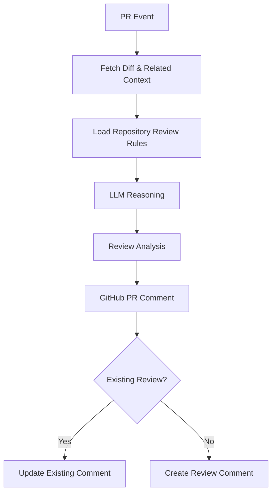

# 🤖 Code Review Agent by boghus

### Stop wasting engineering hours reviewing boilerplate. Catch security, logic, and concurrency bugs before they reach production.

[](https://github.com/boghus/code-review-agent/actions)
[](LICENSE)
[](CONTRIBUTING.md)

**AI-powered code review for GitHub Pull Requests.**

Code Review Agent by boghus reads the change in context, applies your repository's review rules, reasons about potential problems, and publishes actionable feedback directly to the PR.

**Non-blocking by design.** AI helps your team review code faster without becoming another CI bottleneck.

---

## ⚡ Traditional Review vs. Code Review Agent by boghus

| | Traditional Manual Review | **Code Review Agent by boghus** |
|---|---|---|
| **Context** | Reviewer-dependent | 🔎 PR diff + repository rules + related context |
| **Speed** | Minutes to hours | ⚡ Automated on every PR |
| **Boilerplate** | Repeated manually | 🤖 Automated |
| **Logic bugs** | Depends on reviewer availability | 🧠 AI-assisted reasoning |
| **Security** | Manual + tooling | 🛡️ AI-assisted analysis |
| **Race conditions** | Easy to miss | 🔀 Context-aware concurrency analysis |
| **Feedback** | Reviewer comments | 💬 Automated PR feedback |
| **Delivery** | Can become a bottleneck | 🚦 Non-blocking |

---

# 🚀 Quickstart — 30 seconds

## GitHub Action

Create `.github/workflows/review.yml`:

```yaml
name: AI Code Review

on:
  pull_request:

permissions:
  contents: read
  pull-requests: write

jobs:
  review:
    runs-on: ubuntu-latest

    steps:
      - uses: boghus/code-review-agent@v1
        with:
          api-key: ${{ secrets.MY_AI_KEY }}
          model: gemini-3.6-flash
```

### Add your Gemini API key

Create a Gemini API key in [Google AI Studio](https://aistudio.google.com/apikey), then save it as a GitHub Actions secret named `MY_AI_KEY`.

Open a PR and let Code Review Agent by boghus review it.

That's the whole integration.

---

# 🧠 How it works



The core pipeline is intentionally simple:

**PR Event → Context → LLM Reasoning → Review → GitHub**

---

# 🔥 Features

- 🤖 **AI-powered PR reviews** — automatically analyze every Pull Request.
- 🔎 **Context-aware analysis** — reason about the actual diff and relevant repository context.
- 📚 **Repository-specific rules** — define what matters to your engineering team.
- 🛡️ **Security analysis** — identify suspicious patterns and potential vulnerabilities.
- 🧠 **Logic analysis** — catch bugs that simple pattern matching cannot understand.
- 🔀 **Concurrency analysis** — look for race conditions and unsafe shared-state access.
- ⚡ **Performance analysis** — identify unnecessary queries, expensive operations, and resource-management issues.
- 💡 **Actionable feedback** — focus on concrete problems and fixes instead of generic AI commentary.
- 🔁 **Idempotent reviews** — update one existing Code Review Agent by boghus comment instead of spamming the PR.
- 🚦 **Non-blocking** — AI review failures do not become a delivery blocker.
- 🔌 **Provider abstraction** — AI providers are isolated behind a dedicated interface.
- 🏠 **Local-model ready** — the architecture is designed to support self-hosted inference.

---

# 🔌 Multi-Model & Privacy

AI infrastructure should not dictate how your source code is handled.

Code Review Agent by boghus uses a provider abstraction so the review pipeline can evolve independently from the underlying model.

### Cloud providers

The provider architecture is designed for integrations such as:

- Gemini
- OpenAI
- Claude / Anthropic
- DeepSeek

### Local inference

For privacy-sensitive or enterprise environments, the architecture can accommodate local/self-hosted models through technologies such as:

- 🦙 Ollama
- 🧠 DeepSeek-based local models
- 🏠 Other self-hosted LLM runtimes

> **Current RC2 provider:** Gemini.
>
> OpenAI, Claude, Ollama, and DeepSeek are represented as provider targets/architecture capabilities, not as currently shipped integrations unless explicitly implemented in the project.

This distinction keeps the README honest while making the provider architecture clear.

---

# 🔐 Privacy & Security

Code Review Agent by boghus follows a minimal-context approach.

By default, the AI provider receives the information required to perform the review rather than the entire repository.

Typical review input includes:

```text
PR diff
+
Repository review rules
+
Relevant review context
```

The GitHub token is kept separate from the AI prompt:

```text
GITHUB_TOKEN
    │
    └── GitHub API
         └── PR comments

AI API KEY
    │
    └── AiProvider
         └── Configured LLM
```

For organizations that cannot send source code to external AI services, local/self-hosted model providers are the natural extension of the provider architecture.

---

# 🧪 Teach the reviewer how your team works — Experimental

> **Experimental:** this feature has not yet been fully validated in real-world team workflows.

Create:

```text
.github/code_review_rules.md
```

Example:

```markdown
# Code Review Rules

- Flag SQL queries constructed through string concatenation.
- Flag hardcoded secrets and credentials.
- Prefer explicit error handling.
- Identify unnecessary database queries inside loops.
- Flag unsafe concurrent access to shared mutable state.
- Prefer small, focused methods.
```

Rules are loaded from the **PR base ref**.

That matters: contributors cannot simply modify the review rules inside their PR and change the contract used to review their own code.

---

# 💬 One PR. One Review.

Code Review Agent by boghus uses a stable marker:

```html
<!-- code-review-agent-by-boghus -->
```

So repeated pushes update the existing review instead of flooding the conversation.

```text
Push #1 ──→ 💬 Create review
Push #2 ──→ ✏️ Update review
Push #3 ──→ ✏️ Update review
Push #4 ──→ ✏️ Update review
```

**No PR comment spam.**

---

# 🏗️ Architecture

```text
com.boghus.codereview
├── CodeReview
│   └── orchestrator
├── github
│   └── ActionInputs
│       └── environment → typed configuration
├── provider
│   ├── AiProvider
│   ├── AiProviderFactory
│   └── GeminiAdapter
├── review
│   ├── DiffAnalyzer
│   ├── ReviewLanguage
│   └── ReviewPromptBuilder
└── output
    └── ReviewReportWriter
```

The provider boundary is deliberately small:

```groovy
interface AiProvider {
    String review(String prompt)
}
```

This makes the review engine independent from the underlying model provider.

---

# ⚙️ Configuration

| Input | Required | Default | Description |
|---|---:|---|---|
| `api-key` | ✅ | — | AI provider API key |
| `model` | | `gemini-3.6-flash` | Model identifier |
| `provider` | | `gemini` | AI provider |
| `language` | | `en` | Review language |
| `rules-path` | | `.github/code_review_rules.md` | Review rules |
| `diff-path` | | `cra-pr.diff` | Diff file |
| `output-path` | | `cra-review.md` | Review output |
| `github-token` | | `${{ github.token }}` | GitHub API token |
| `max-diff-bytes` | | `200000` | Maximum diff size |
| `max-diff-lines` | | `4000` | Maximum diff lines |

---

# 🧪 Development

Run the full build:

```bash
gradle build
gradle test
```

Generate a diff:

```bash
git diff --unified=80 HEAD~1 HEAD > /tmp/cra-pr.diff
```

---

# 🔌 Add your own provider

Implement the provider interface:

```groovy
class MyProvider implements AiProvider {

    @Override
    String review(String prompt) {
        // Call your model here
    }
}
```

Register it through:

```text
AiProviderFactory.REGISTRY
```

The rest of the review pipeline remains unchanged.

---

# 🤝 Contributing

Code Review Agent by boghus is open source.

Whether you want to improve the reviewer, add a provider, write security rules, improve performance, or expand test coverage — contributions are welcome.

### Good first contribution

Start with issues labelled **[`good first issue`](https://github.com/boghus/code-review-agent/issues?q=is%3Aissue+is%3Aopen+label%3A%22good+first+issue%22)**.

Then:

```bash
git checkout -b feature/my-change
gradle build
gradle test
```

Open a Pull Request.

---

# ⭐ If this saves you time, star it.

A star helps other developers discover the project.

If you build something with Code Review Agent by boghus:

- ⭐ Star the repository
- 🍴 Fork it
- 🐛 Open an issue
- 💻 Submit a PR
- 🔌 Build a new provider

**The best AI code reviewer is the one your team can actually control.**

---

## 📄 License

Apache License 2.0.

<p align="center">

### 🤖 Review faster. Catch more. Ship confidently.

**AI-powered code review, directly inside GitHub.**

</p>
