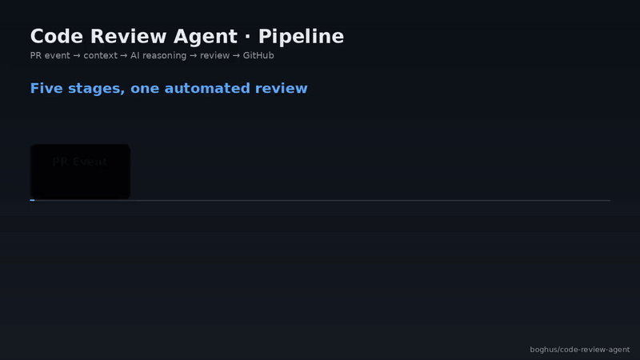
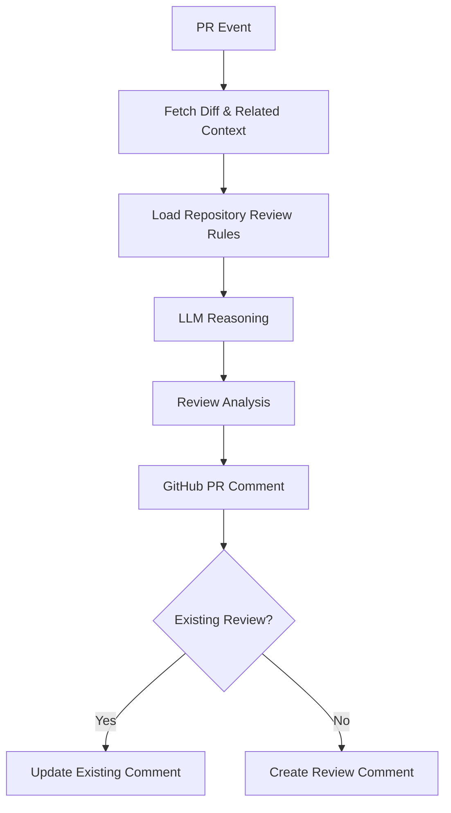

# 🤖 Code Review Agent by boghus

### Stop wasting engineering hours reviewing boilerplate. Catch security, logic, and concurrency bugs before they reach production.

[](https://github.com/boghus/code-review-agent/actions)
[](LICENSE)
[](CONTRIBUTING.md)

**AI-powered code review for GitHub Pull Requests.**

Code Review Agent by boghus reads the change in context, applies your repository's review rules, reasons about potential problems, and publishes actionable feedback directly to the PR.

**Non-blocking by design.** AI helps your team review code faster without becoming another CI bottleneck.

---

## ⚡ Traditional Review vs. Code Review Agent by boghus

| | Traditional Manual Review | **Code Review Agent by boghus** |
|---|---|---|
| **Context** | Reviewer-dependent | 🔎 PR diff + repository rules + related context |
| **Speed** | Minutes to hours | ⚡ Automated on every PR |
| **Boilerplate** | Repeated manually | 🤖 Automated |
| **Logic bugs** | Depends on reviewer availability | 🧠 AI-assisted reasoning |
| **Security** | Manual + tooling | 🛡️ AI-assisted analysis |
| **Race conditions** | Easy to miss | 🔀 Context-aware concurrency analysis |
| **Feedback** | Reviewer comments | 💬 Automated PR feedback |
| **Delivery** | Can become a bottleneck | 🚦 Non-blocking |

---

# 🚀 Quickstart — 30 seconds

## GitHub Action

Create `.github/workflows/review.yml`:

```yaml
name: AI Code Review

on:
  pull_request:

permissions:
  contents: read
  pull-requests: write

jobs:
  review:
    runs-on: ubuntu-latest

    steps:
      - uses: boghus/code-review-agent@v1
        with:
          api-key: ${{ secrets.MY_AI_KEY }}
          model: gemini-3.6-flash
```

### Add your Gemini API key

Create a Gemini API key in [Google AI Studio](https://aistudio.google.com/apikey), then save it as a GitHub Actions secret named `MY_AI_KEY`.

Open a PR and let Code Review Agent by boghus review it.

That's the whole integration.

---

# 🎬 Demo

Real, animated walkthrough of the review pipeline — from PR event to published comment.



📦 [Source PR · boghus/code-review-agent#76](https://github.com/boghus/code-review-agent/pull/76)

The demo is generated from the actual output of `boghus/code-review-agent` running against intentional QA fixtures (real workflow, real Gemini review, real PR comment). It corresponds to the behavior of `main` at the time of the v1.0.0-rc.2 release.

---

# 🧠 How it works


```mermaid
graph TD
    A[PR Event] --> B[Fetch Diff & Related Context]
    B --> C[Load Repository Review Rules]
    C --> D[LLM Reasoning]
    D --> E[Review Analysis]
    E --> F[GitHub PR Comment]
    F --> G{Existing Review?}
    G -->|Yes| H[Update Existing Comment]
    G -->|No| I[Create Review Comment]
```

The core pipeline is intentionally simple:

**PR Event → Context → LLM Reasoning → Review → GitHub**

---

# 🔥 Features

- 🤖 **AI-powered PR reviews** — automatically analyze every Pull Request.
- 🔎 **Context-aware analysis** — reason about the actual diff and relevant repository context.
- 📚 **Repository-specific rules** — define what matters to your engineering team.
- 🛡️ **Security analysis** — identify suspicious patterns and potential vulnerabilities.
- 🧠 **Logic analysis** — catch bugs that simple pattern matching cannot understand.
- 🔀 **Concurrency analysis** — look for race conditions and unsafe shared-state access.
- ⚡ **Performance analysis** — identify unnecessary queries, expensive operations, and resource-management issues.
- 💡 **Actionable feedback** — focus on concrete problems and fixes instead of generic AI commentary.
- 🔁 **Idempotent reviews** — update one existing Code Review Agent by boghus comment instead of spamming the PR.
- 🚦 **Non-blocking** — AI review failures do not become a delivery blocker.
- 🔌 **Provider abstraction** — AI providers are isolated behind a dedicated interface.
- 🏠 **Local-model ready** — the architecture is designed to support self-hosted inference.

---

# 🔌 Multi-Model & Privacy

AI infrastructure should not dictate how your source code is handled.

Code Review Agent by boghus uses a provider abstraction so the review pipeline can evolve independently from the underlying model.

### Cloud providers

The provider architecture is designed for integrations such as:

- Gemini
- OpenAI
- Claude / Anthropic
- DeepSeek

### Local inference

For privacy-sensitive or enterprise environments, the architecture can accommodate local/self-hosted models through technologies such as:

- 🦙 Ollama
- 🧠 DeepSeek-based local models
- 🏠 Other self-hosted LLM runtimes

> **Current RC2 provider:** Gemini.
>
> OpenAI, Claude, Ollama, and DeepSeek are represented as provider targets/architecture capabilities, not as currently shipped integrations unless explicitly implemented in the project.

This distinction keeps the README honest while making the provider architecture clear.

---

# 🔐 Privacy & Security

Code Review Agent by boghus follows a minimal-context approach.

By default, the AI provider receives the information required to perform the review rather than the entire repository.

Typical review input includes:

```text
PR diff
+
Repository review rules
+
Relevant review context
```

The GitHub token is kept separate from the AI prompt:

```text
GITHUB_TOKEN
    │
    └── GitHub API
         └── PR comments

AI API KEY
    │
    └── AiProvider
         └── Configured LLM
```

For organizations that cannot send source code to external AI services, local/self-hosted model providers are the natural extension of the provider architecture.

---

# 🧪 Teach the reviewer how your team works — Experimental

> **Experimental:** this feature has not yet been fully validated in real-world team workflows.

Create:

```text
.github/code_review_rules.md
```

Example:

```markdown
# Code Review Rules

- Flag SQL queries constructed through string concatenation.
- Flag hardcoded secrets and credentials.
- Prefer explicit error handling.
- Identify unnecessary database queries inside loops.
- Flag unsafe concurrent access to shared mutable state.
- Prefer small, focused methods.
```

Rules are loaded from the **PR base ref**.

That matters: contributors cannot simply modify the review rules inside their PR and change the contract used to review their own code.

---

# 💬 One PR. One Review.

Code Review Agent by boghus uses a stable marker:

```html
<!-- code-review-agent-by-boghus -->
```

So repeated pushes update the existing review instead of flooding the conversation.

```text
Push #1 ──→ 💬 Create review
Push #2 ──→ ✏️ Update review
Push #3 ──→ ✏️ Update review
Push #4 ──→ ✏️ Update review
```

**No PR comment spam.**

---

# 🏗️ Architecture

```text
com.boghus.codereview
├── CodeReview
│   └── orchestrator
├── github
│   └── ActionInputs
│       └── environment → typed configuration
├── provider
│   ├── AiProvider
│   ├── AiProviderFactory
│   └── GeminiAdapter
├── review
│   ├── DiffAnalyzer
│   ├── ReviewLanguage
│   └── ReviewPromptBuilder
└── output
    └── ReviewReportWriter
```

The provider boundary is deliberately small:

```groovy
interface AiProvider {
    String review(String prompt)
}
```

This makes the review engine independent from the underlying model provider.

---

# ⚙️ Configuration

| Input | Required | Default | Description |
|---|---:|---|---|
| `api-key` | ✅ | — | AI provider API key |
| `model` | | `gemini-3.6-flash` | Model identifier |
| `provider` | | `gemini` | AI provider |
| `language` | | `en` | Review language |
| `rules-path` | | `.github/code_review_rules.md` | Review rules |
| `diff-path` | | `cra-pr.diff` | Diff file |
| `output-path` | | `cra-review.md` | Review output |
| `github-token` | | `${{ github.token }}` | GitHub API token |
| `max-diff-bytes` | | `200000` | Maximum diff size |
| `max-diff-lines` | | `4000` | Maximum diff lines |

---

# 🛠️ Troubleshooting

If your first review does not work as expected, use this checklist before opening an issue. The examples below match the currently supported GitHub Action configuration.

## 🔑 API key or authentication

**How to recognize it:** the report says that `api-key` is missing or authentication failed.

**Likely cause:** the secret was not mapped to the Action, the secret name is incorrect, or the API key cannot access the configured model.

**What to check:**

```yaml
- uses: boghus/code-review-agent@v1
  with:
    api-key: ${{ secrets.MY_AI_KEY }}
```

Verify that `MY_AI_KEY` exists under **Repository → Settings → Secrets and variables → Actions**.

**Recommended action:** create or update the repository secret and rerun the workflow. Never paste API keys into workflows, issues, or Pull Request comments.

---

## 🤖 Provider or model configuration

**How to recognize it:** the report indicates that the provider is not supported or that the configured provider/model could not complete the review.

**Likely cause:** an unsupported provider or an invalid/unavailable model identifier.

**What to check:**

```yaml
provider: gemini
model: gemini-3.6-flash
```

The currently shipped provider is **Gemini**. OpenAI, Claude, Ollama, and DeepSeek are architecture targets, not currently shipped integrations.

**Recommended action:** start with the supported configuration above and verify any custom model identifier against your Gemini API configuration.

---

## 🧩 Git diff generation

**How to recognize it:** the report contains `Failed to generate Git diff`.

**Likely cause:** the Action could not build the diff between the Pull Request base and head commits.

**What to check:**

1. Confirm the workflow runs on the `pull_request` event.
2. Check the **Run Code Review Agent** step in the workflow logs.
3. Verify that the Pull Request still has valid base and head commits.
4. If the failure appeared after rebasing or force-pushing, rerun the workflow.

**Recommended action:** rerun after confirming the PR commits are available. If it persists, include the workflow run URL and error message when opening an issue.

An empty diff is not necessarily an error: a PR with no effective changes can produce an empty review.

---

## 💬 Review generated but not published

**How to recognize it:** review generation succeeds, but no Code Review Agent comment appears on the Pull Request.

**Likely cause:** the workflow token cannot write Pull Request comments.

**What to check:**

```yaml
permissions:
  contents: read
  pull-requests: write
```

Also check the steps that find and create/update the review comment.

**Recommended action:** if `github-token` uses `${{ github.token }}`, add the required permissions at workflow or job level and rerun the workflow. For Pull Requests from forks, check whether GitHub restricts `GITHUB_TOKEN` to read-only. If you configure a custom `github-token`, verify that token's permissions; workflow permissions do not grant permissions to that token. The Action keeps one identifiable review comment and updates it on subsequent runs.

---

## 📚 Invalid `rules-path`

**How to recognize it:** the report says that the trusted review rules are invalid or could not be loaded from the Pull Request base revision.

**Likely cause:** the configured path is not a valid repository-relative file, the file does not exist in the PR base, or the path contains unsafe components.

**What to check:**

```yaml
rules-path: .github/code_review_rules.md
```

The path must be relative to the repository, point to a regular file, not start with `/` or `-`, and not contain empty, `.` or `..` path components.

Rules are loaded from the **PR base ref**, not from the modified version inside the Pull Request.

**Recommended action:** make sure the rules file exists in the target branch and that `rules-path` points to it. Changes to that file inside the same PR are intentionally not used to review that PR.

---

## 🔐 GitHub Actions permissions

**How to recognize it:** the Action can run the review but fails when publishing or updating the Pull Request comment.

**Likely cause:** the workflow token does not have sufficient permissions.

**What to check:**

```yaml
permissions:
  contents: read
  pull-requests: write
```

For restricted repositories or organizations, also check **Settings → Actions → General**.

**Recommended action:** grant only the required permissions and rerun the workflow. The GitHub token is used for GitHub operations and is kept separate from the AI provider process; it is not sent as part of the review request.

---

## 🤷 Review without findings or unexpected output

**How to recognize it:** the review is published successfully, but contains no findings or does not look as expected.

**Likely causes:** the diff contains no relevant changes, the review rules do not request the analysis you expected, the diff is too large, or the model returned no findings.

**What to check:**

```yaml
max-diff-bytes: 200000
max-diff-lines: 4000
```

If either limit is exceeded, Code Review Agent writes a warning instead of sending the oversized diff to the model. Also review the rules configured through `rules-path`.

**Recommended action:** use a smaller test PR to verify the integration, then test progressively larger or more complex changes.

A review with no findings means the reviewer did not report findings under the configured review contract. It is **not** a guarantee that the code has no bugs.

---

## 🆘 Still having problems?

Before opening an issue, collect:

- the workflow run URL;
- the Code Review Agent version or Action ref;
- the configured provider and model;
- the relevant error message;
- whether the review comment was created.

Do **not** include API keys, GitHub tokens, or other secrets.

Describe what you expected to happen and what actually happened. This makes the issue easier to reproduce and diagnose.

---

# 🧪 Development

Run the full build:

```bash
gradle build
gradle test
```

Generate a diff:

```bash
git diff --unified=80 HEAD~1 HEAD > /tmp/cra-pr.diff
```

---

# 🔌 Add your own provider

Implement the provider interface:

```groovy
class MyProvider implements AiProvider {

    @Override
    String review(String prompt) {
        // Call your model here
    }
}
```

Register it through:

```text
AiProviderFactory.REGISTRY
```

The rest of the review pipeline remains unchanged.

---

# 🤝 Contributing

Code Review Agent by boghus is open source.

Whether you want to improve the reviewer, add a provider, write security rules, improve performance, or expand test coverage — contributions are welcome.

### Good first contribution

Start with issues labelled **[`good first issue`](https://github.com/boghus/code-review-agent/issues?q=is%3Aissue+is%3Aopen+label%3A%22good+first+issue%22)**.

Then:

```bash
git checkout -b feature/my-change
gradle build
gradle test
```

Open a Pull Request.

---

# ⭐ If this saves you time, star it.

A star helps other developers discover the project.

If you build something with Code Review Agent by boghus:

- ⭐ Star the repository
- 🍴 Fork it
- 🐛 Open an issue
- 💻 Submit a PR
- 🔌 Build a new provider

**The best AI code reviewer is the one your team can actually control.**

---

## 📄 License

Apache License 2.0.

<p align="center">

### 🤖 Review faster. Catch more. Ship confidently.

**AI-powered code review, directly inside GitHub.**

</p>
