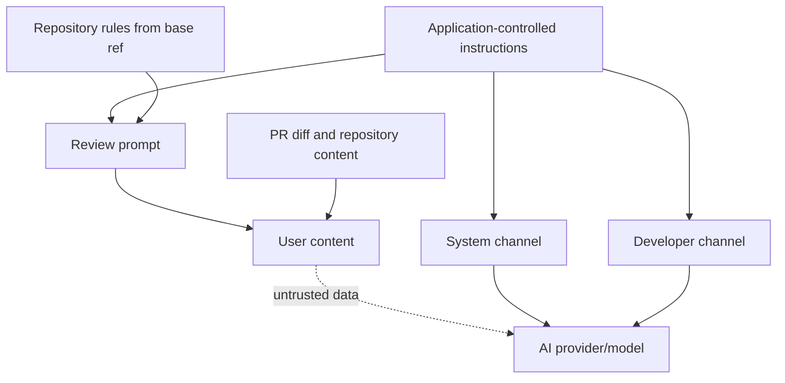

# Prompt injection threat model

Pull request content is untrusted input. A contributor can place instructions in source code, comments, strings, Markdown, YAML, commit messages, or other repository-controlled content.

## Trust boundary

The critical invariant is that repository-controlled content is never promoted into a trusted system or developer channel. For providers without those native channels, explicit delimiters are only defense-in-depth.

## Invariants

1. Trusted review instructions are built by the application and kept separate from repository content.
2. Repository content is always classified as untrusted data.
3. Provider adapters use the strongest instruction channels available to them.
4. A provider without a system or developer channel falls back to explicit delimiters; delimiters are defense-in-depth, not a hard security boundary.
5. API keys, GitHub tokens, and other secrets must never be included in model input.
6. Model output is untrusted and must never be executed as shell commands, code, GitHub Actions expressions, or authorization logic.

## Provider capability mapping

The core review request exposes `systemInstructions`, `developerInstructions`, `prompt`, and `untrustedRepositoryContent`. Each provider declares which channels it supports and maps the request accordingly.

For example, Gemini currently supports a system instruction channel but not a separate developer channel in the Generate Content configuration used by this project. Its adapter combines the two trusted instruction fields into `systemInstruction` and sends the prompt plus repository diff as user content.

This design lets future providers use a native developer channel when available without changing the review domain model.
